# 3D Works Portfolio

## 作品名：Bear

### 概要
YouTubeのチュートリアルを参考に制作した、スタジオライティングのクマの3Dモデリング作品

### Final Render

#### Details & Topology
| 側面 | 背面 | ワイヤーフレーム |
| :---: | :---: | :---: |
| 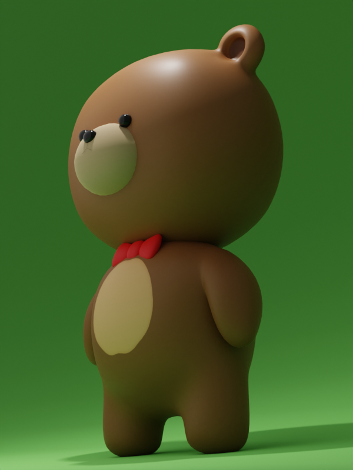 |  | 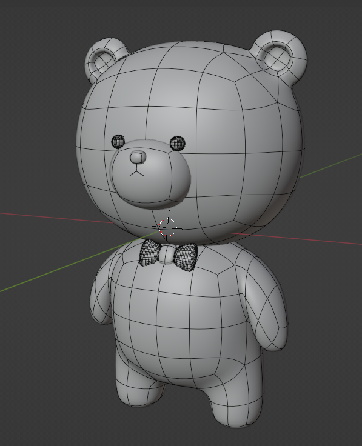 |

### 使用技術
| 項目 | 内容 |
| :--- | :--- |
| **Modeling** | サブディビジョンサーフェスを用いたローポリ・モデリング |
| **Material** | プリンシプルBSDFによるPBR質感設定 |
| **Lighting** | キーライト、トップライトをベースとした構成 |
| **Rendering** | Cycles |

### シーン構成
* **Assets**: クマのキャラクター（本体・リボン）、スタジオ背景
* **Lighting**: 
    * **キーライト (Point Light)**: 顔の表情を強調し、瞳にキャッチライトを演出
    * **トップライト (Area Light)**: 接地感のある柔らかな影を生成
* **Camera**

### 工夫点：ライティング
本作品では、プロのスタジオ撮影を意識したライティングを構築した。
| ライト配置前 | ライト配置後 |
| :---: | :---: |
| 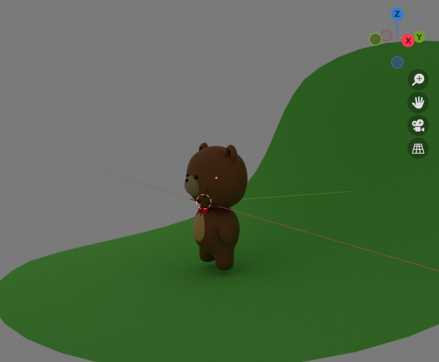 | 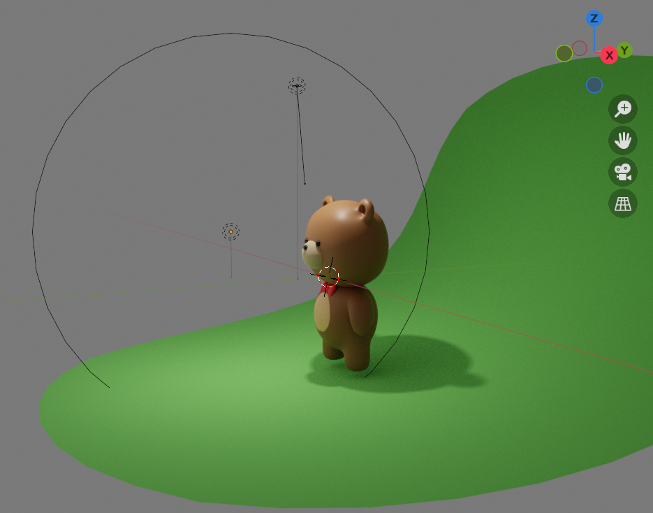 |

特にライティングに注力し、以下の演出を行った。
1. **視線誘導のための「キーライト」**
* クマの顔に焦点を当てるため、ポイントライトを前方に配置した。瞳にキャッチライトが入るよう調整し、キャラクターの表情を生き生きとさせた。

2. **実在感を高める「エリアライト」**
* 頭上からエリアライトを照射することで、足元に柔らかな影を生成した。これによりモデルが空間に浮いているような違和感を消し、存在感を表現した。

3. **スタジオセットの構築（グリーンバック）**
* 現実のモデル撮影と同様に背後に曲面の平面メッシュを配置し、グリーンバック環境を作成した。被写体と背景を明確に分離し、モデルのシルエットを際立たせている。

> **参考資料** [さあ、blenderでクマのキャラクターを作ろう！初心者向けチュートリアル/3D Bibi](https://youtu.be/WPYuwaWaNVA?si=LYwPXqiCG8wO5QR-)

## 作品名：Gun(Neo Frontier Sheriff)

### 概要

本作品は、人気FPSゲーム『VALORANT』に登場する武器スキン「ネオフロンティア シェリフ（レベル4 / ヴァリアント1 ゴールド）」をモチーフにした3Dモデリング作品である。近未来的なデザインと、リボルバーが持つクラシックな雰囲気が融合した独特のデザインを再現している。

### Final Render
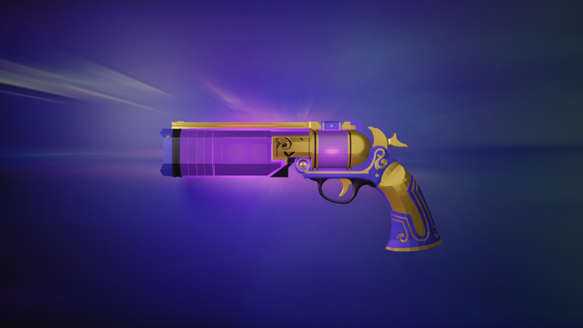

#### Details & Topology
| 正面 | 背面 | ワイヤーフレーム |
| :---: | :---: | :---: |
| 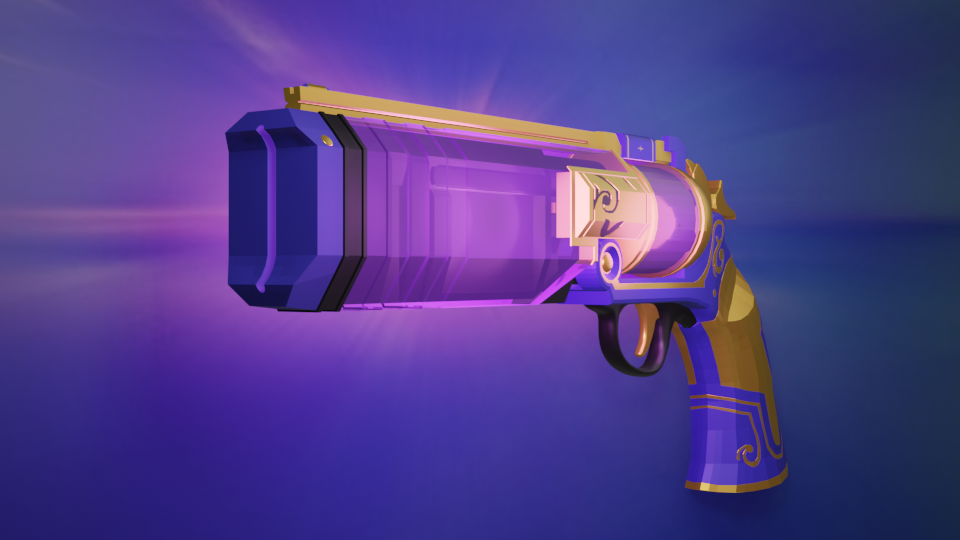 |  | 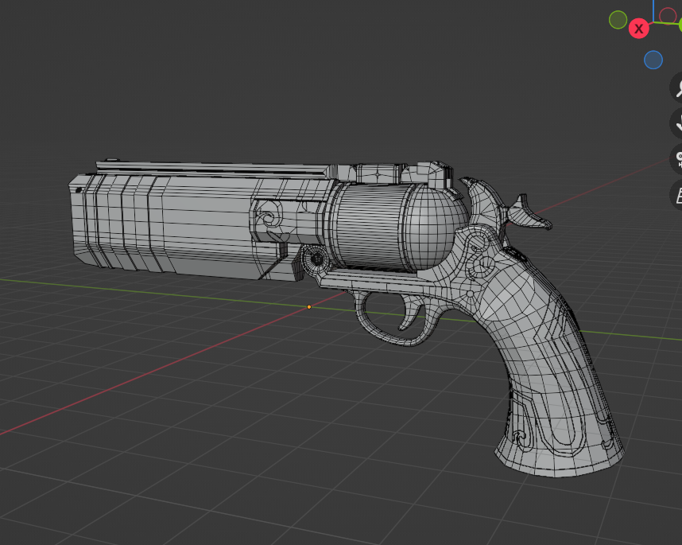 |

### 使用技術
| 項目 | 内容 |
| :--- | :--- |
| **Modeling** | ハードサーフェス・モデリング |
| **Material** | プリンシプルBSDFによるPBR質感設定 |
| **Lighting** | ポイントライトを用いた発光表現 |
| **Rendering** | Eevee |

### シーン構成
* **Assets**: シェリフ（各可動パーツ別構成）、背景用プレーン
* **Lighting**:
    * **メイン・スポットライト**: シーン全体に「紫色」の空気感を演出
    * **アクセント・ポイントライト**: 金属パーツへのハイライト、および発光部の表現
* **Camera**

### 工夫点
モデルの持つ「紫色の世界観」と「金属の高級感」の表現に注力した。
| ライト配置前 | ライト配置後 |
| :---: | :---: |
| 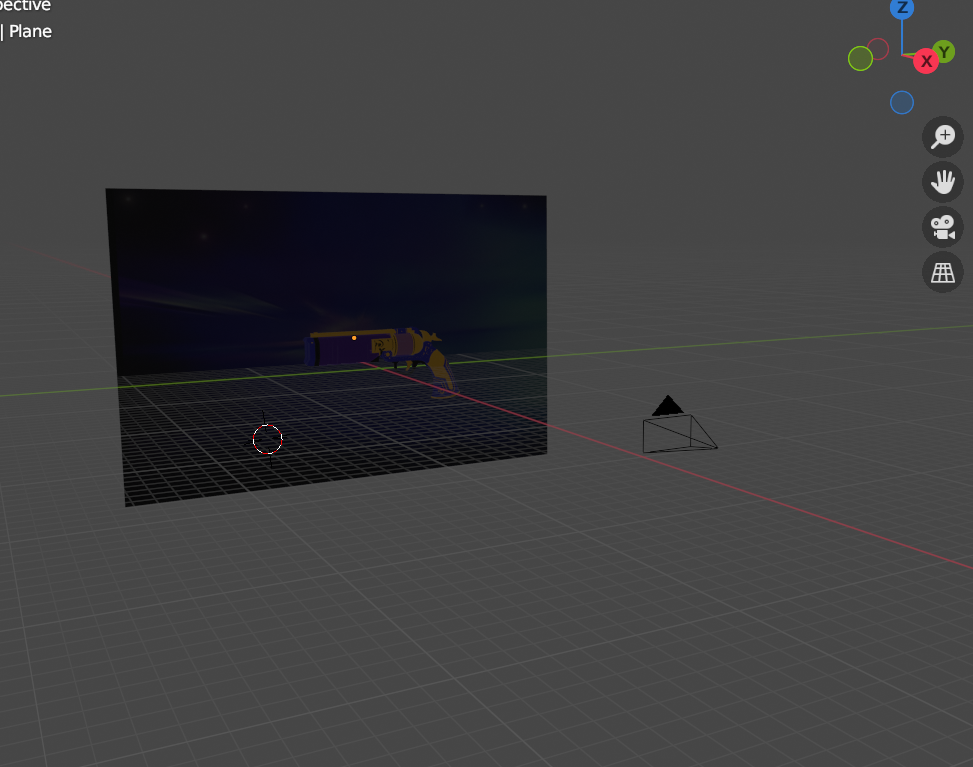 | 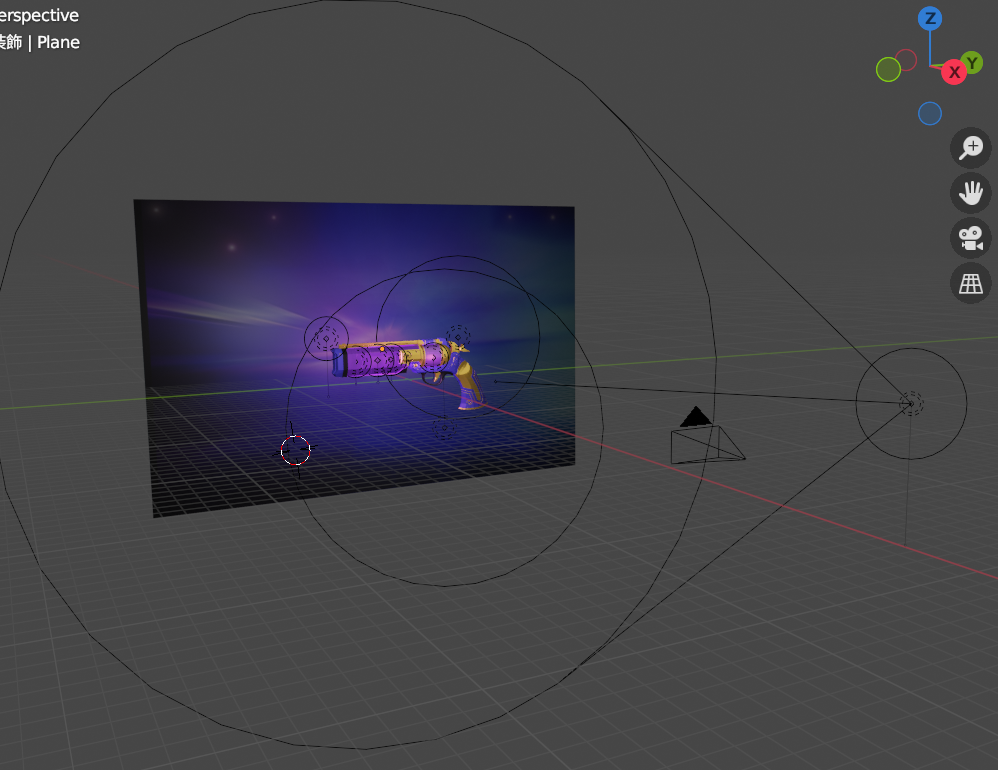 |

* **モデリング：忠実なフォルムの再現**
    * シェリフ特有の重厚なシルエットを崩さず、リロード時のシリンダー回転を想定したパーツ分けを行っている。
* **ライティング：発光エフェクト**
    * シリンダー内部にポイントライトを配置し発光を表現し、背景との調和をとった。
* **ライティング：質感の強調**
    * ゴールド部分に鋭いハイライトを入れるため、3つのポイントライトを配置し、硬質な金属感を演出した。

## 作品名：Totoro in the Rain

### 概要
スタジオジブリの名作『となりのトトロ』の雨のバス停シーンをモチーフにした、3Dアニメーション作品である。キャラクターの造形に加え、雨のエフェクト実装や、実写背景と3Dモデルを馴染ませる環境構築に注力した。

### Final Render

#### Details & Topology
| 側面 | 背面 | ワイヤーフレーム |
| :---: | :---: | :---: |
| 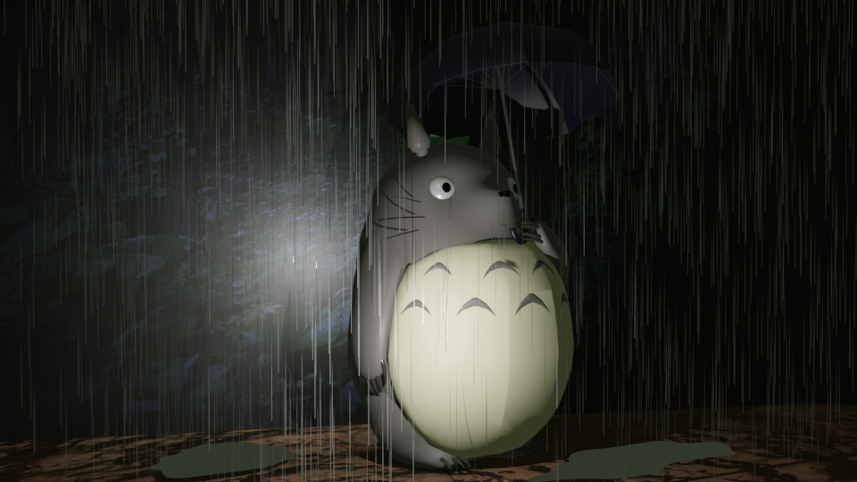 |  | 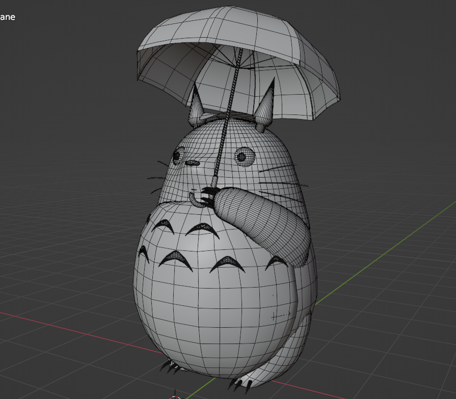 |

### 使用技術
| 項目 | 内容 |
| :--- | :--- |
| **Modeling** | サブディビジョンサーフェスを用いたローポリ・モデリング |
| **Animation** | パーティクルシステムを用いた雨のシミュレーション |
| **Material** | プリンシプルBSDFによるPBR質感設定 |
| **Rendering** | Eevee |

### シーン構成
* **Assets**: トトロ、傘、雨粒（パーティクル）、背景用プレーン（森の画像）
* **Lighting**: 
    * **メイン・ポイントライト (Point Light)**: 右前方から照射し、該当シーンの光を再現
    * **ベース・エリアライト (Area Light)**: 全体の明度と色味を整え、シーンに統一感を醸成
    * **バック・エリアライト (Area Light)**: トトロの背後から背景に向けて配置し、被写体と背景の境界を馴染ませ、奥行きを演出
* **Camera**

### 工夫点：ライティング
該当シーンの幻想的な「雨の夜」の雰囲気を再現するため、以下の点に注力した。
| ライト配置前 | ライト配置後 |
| :---: | :---: |
| 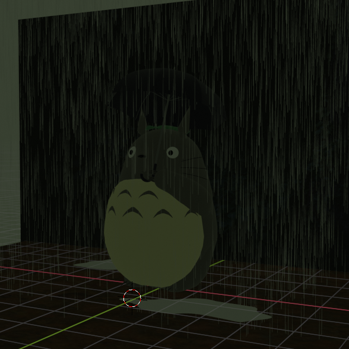 | 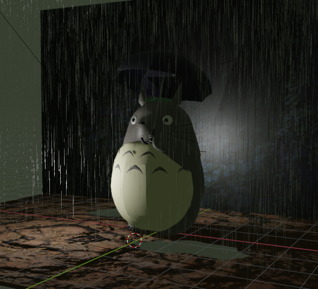 |

1. **雨のアニメーションと傘のモデリング**
* YouTubeのチュートリアルを参考に、パーティクルシステムを用いてリアリティのある雨のアニメーションを再現した。傘は雨粒との接触時に自然に動作するように配置し、リアリティをだした。

2. **キャラクターの独自造形**
* トトロ本体は資料を元にゼロからモデリングを行い、顔パーツのバランス・シルエットの再現に注力した。

3. **背景と調和させるライティング**
* 背景の「雨の森」の画像と3Dモデルを違和感なく融合させるため、トトロの背後から背景方向へエリアライトを照射し、、画像とモデルの間の「空気感」を擬似的に作り出し、自然な調和を実現した。

> **参考資料** [【初心者向け】Blenderでシンプルな傘をモデリング / Umbrella modeling【Blender】/モルト/3Dモデリング](https://youtu.be/E7HnlCa-pNk?si=srb5Yl9ci2fj9geY)[【blender 雨】雨を降らせよう！（ゆっくりボイス）/e3D](https://youtu.be/auK09SBmEv8?si=t7rqXOTN5JYiQcP6)
